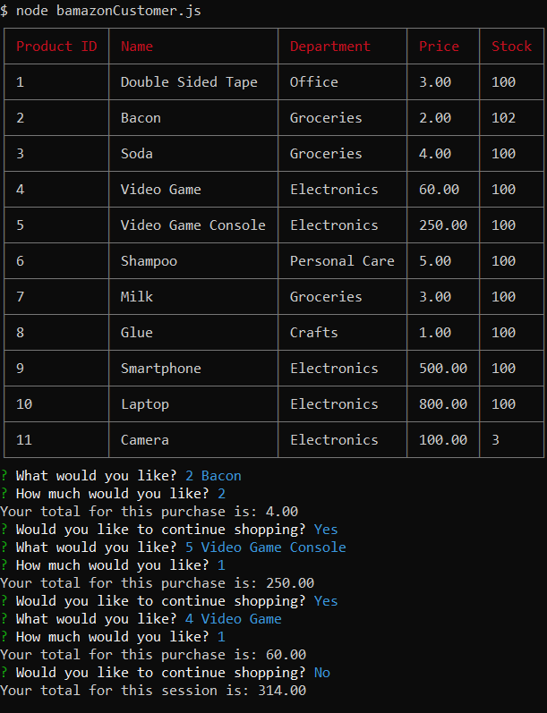
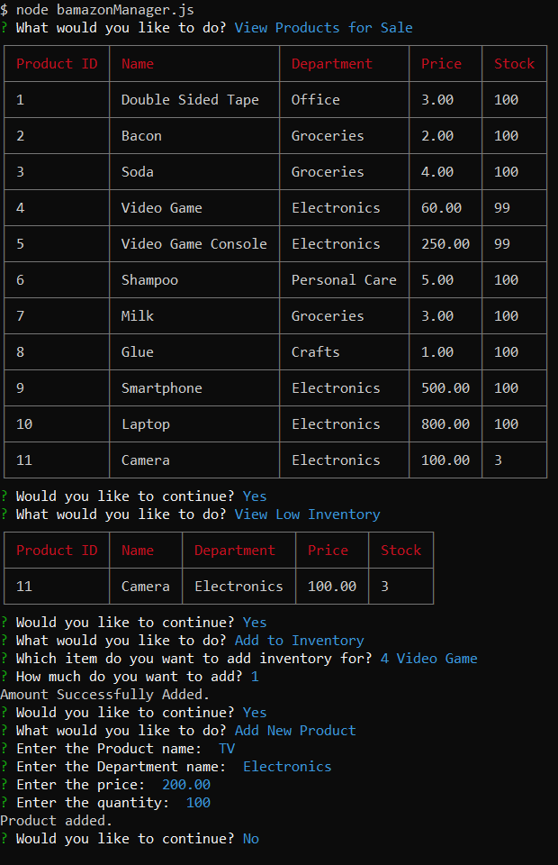
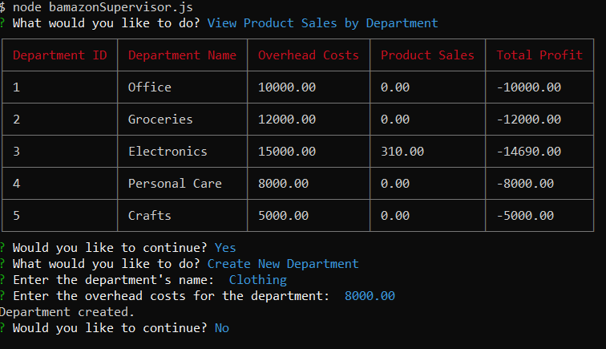

# storefrontdb

This application is a CLI application which acts like a storefront by performing SQL queries on MySQL database to store data. A customer can buy stuff from the store. A manager can check inventory, check low inventory, add stock to an existing product, or add a new product. A Supervisor can check department sales figures and add new departments.

# Installation

There is a SQL seed file for MySQL databases provided.

The application needs a .env file to connect to the database. The file should containt the following:
```
    DBHOST=<hostname>
    DBPORT=<port>
    DBUSER=<username>
    DBPASS=<password>
    DBDATABASE=<databasename>
```

Also node packages must be installed for the application to work

# User Interaction

## Customer



1. Application will display to the user a list of items and a prompt for the user to select an item.
2. User enters the item and the amount they want to purchase.
3. Application will attempt the purchase.
    * If there isn't enough of the item, an error will be shown to the user.
4. Application will ask the user is they wish to continue shopping and will repeat if the user confirms.

## Manager



1. Application will display a menu of options to the user
    * View Products for Sale
    * View Low Inventory
    * Add to Inventory
    * Add to Products
2. User selects an option
3. Application will display information depending on user choice:
    * "View Products for Sale" and "View Low Inventory" will display a table to the user.
    * "Add to Inventory" and "Add to Products" will display a set of prompts for the user to input values for.
4. Application will attempt any changes the user enters and will show any errors that occur.
5. Application will ask the user if they would like to continue, and will repeat if the user confirms.

## Supervisor



1. Application will display a menu of options to the user
    * View Product Sales by Department
    * Add Department
2. User selects an option
3. Application will display information depending on user choice:
    * "View Product Sales by Department" will show all deparments, their overhead costs, and sales to the user
    * "Add Department" will display a set of prompts the user can input values for
4. Application will attempt any changes the user enters and will show any errors that occur.
5. Application will ask the user if they would like to continue, and will repeat if the user confirms.